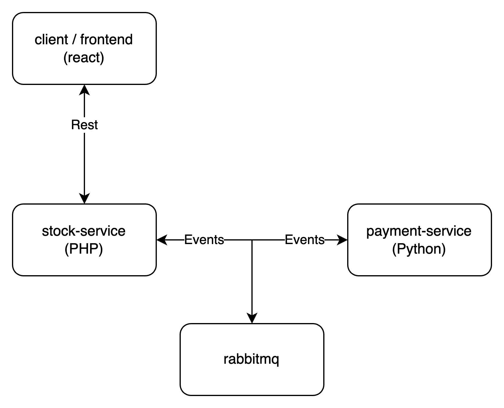
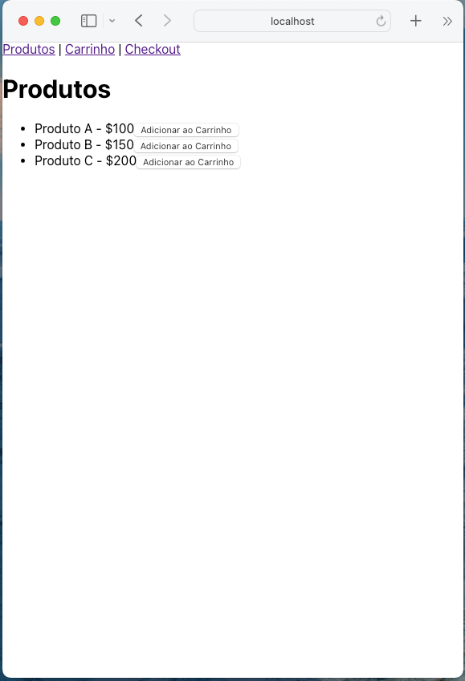
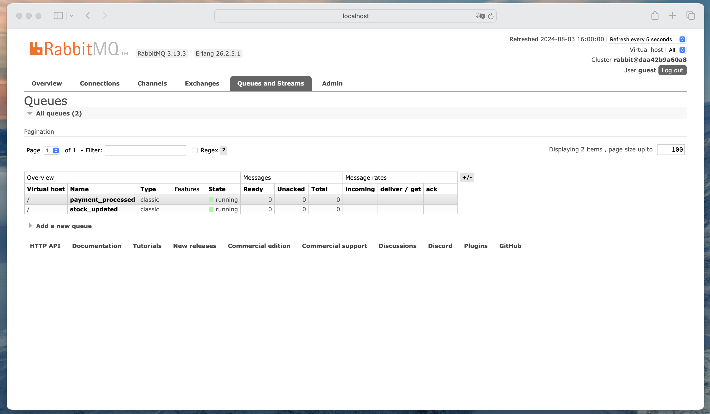

# Event-driven Architecture (EDA)

Arquitetura de Software é um grande Trade-off no mundo da tecnologia, muitas vezes a escolha de uma arquitetura errada pode levar a um grande retrabalho e atraso no projeto. Sabendo disso, sempre é bom conhecer as arquiteturas mais utilizadas e entender o que cada uma tem de melhor para dessa forma escolher a que vai causar menos problemas no futuro, e esse é o grande segredo de uma boa arquitetura, prever o futuro.

Neste artigo vamos falar sobre a Arquitetura Orientada a Eventos (Event-driven Architecture - EDA), uma arquitetura que tem como principal característica a comunicação entre os serviços através de eventos.

## O que é EDA?

A Arquitetura Orientada a Eventos (Event-driven Architecture - EDA) é um estilo de arquitetura de software que promove a produção, detecção, consumo e reação a eventos. Um evento pode ser qualquer coisa que seja notável ou significativa para o sistema, como alterações de estado, uma ação do usuário, um erro, uma mensagem recebida, entre outros.

Os eventos são mensagens assíncronas que são geradas por um produtor e consumidas por um ou mais consumidores. O produtor não precisa saber quem são os consumidores, e os consumidores não precisam saber quem são os produtores. Isso permite que os sistemas sejam desacoplados, escaláveis e flexíveis.

No nosso exemplo de hoje vamos simular o seguinte cenário:



O sistema é composto por 4 serviços:

- **ecommerce-frontend**:
  - Frontend de um e-commerce que permite ao usuário adicionar produtos ao carrinho.
  - Usa React para criar a interface do usuário.



---

- **stock-service**:
  - Serviço que gerencia o estoque dos produtos.
  - Usa PHP para comuncição com o RabbitMQ.

```php
  <?php
require __DIR__ . '/vendor/autoload.php';

use PhpAmqpLib\Connection\AMQPStreamConnection;
use PhpAmqpLib\Message\AMQPMessage;


header("Access-Control-Allow-Origin: *");
header("Access-Control-Allow-Headers: *");
header("Access-Control-Allow-Methods: *");

if ($_SERVER['REQUEST_METHOD'] === 'POST') {

    $order = json_decode(file_get_contents('php://input'), true);

    $success = true; 

    $connection = new AMQPStreamConnection('rabbitmq', 5672, 'guest', 'guest');
    $channel = $connection->channel();

    $channel->queue_declare('stock_updated', false, false, false, false);

    $msg = new AMQPMessage(json_encode([
        'order_id' => 1,
        'status' => 'updated'
    ]));

    $channel->basic_publish($msg, '', 'stock_updated');

    $channel->close();
    $connection->close();

    header('Content-Type: application/json');
    echo json_encode(['success' => $success]);
}
```

>O código acima é somente um exemplo didático, não é um código funcional e nem seguro.

---

- **payment-service**:
  - Serviço que os pagamentos dos pedidos.
  - Usa Python para comunicação com o RabbitMQ.

```python
import pika
import json
import time

max_retries = 5
retry_delay = 5

def establish_connection(max_retries, retry_delay):
    for i in range(max_retries):
        try:
            connection = pika.BlockingConnection(pika.ConnectionParameters('rabbitmq'))
            return connection
        except pika.exceptions.AMQPConnectionError:
            if i < max_retries - 1:
                time.sleep(retry_delay)
            else:
                raise

def process_payment(order):
    print(f"Processando pagamento para o pedido: {order['order_id']}")
    return True

def callback(ch, method, properties, body):
    order = json.loads(body)
    success = process_payment(order)
    
    payment_event = json.dumps({
        'order_id': order['order_id'],
        'status': 'processed' if success else 'failed'
    })
    
    try:
        channel.basic_publish(exchange='', routing_key='payment_processed', body=payment_event)
        print(f"Pagamento {'sucesso' if success else 'falha'} para o pedido: {order['order_id']}")
    except pika.exceptions.AMQPError as e:
        print(f"Erro ao publicar mensagem: {str(e)}")

def setup_channel(connection):
    channel = connection.channel()
    channel.queue_declare(queue='stock_updated')
    channel.queue_declare(queue='payment_processed')
    channel.basic_consume(queue='stock_updated', on_message_callback=callback, auto_ack=True)
    return channel

if __name__ == "__main__":
    connection = establish_connection(max_retries, retry_delay)
    channel = setup_channel(connection)
    print('Aguardando eventos de atualização de estoque...')
    try:
        channel.start_consuming()
    except KeyboardInterrupt:
        print('Interrompido pelo usuário')
    finally:
        if connection:
            connection.close()
```

>O código acima é somente um exemplo didático, não é um código funcional e nem seguro.

---

- **rabbitmq**:
  - Servidor de mensageria que permite a comunicação entre os serviços.


---

O link para o repositório com o código completo está disponível [aqui](https://github.com/sschonss/event-driver).

## Fluxo de comunicação

1. O usuário acessa o frontend do e-commerce e adiciona um produto ao carrinho.

2. O frontend envia uma requisição para o serviço de estoque para realizar o checkout do produto.

3. O serviço de estoque verifica se o produto está disponível e envia um evento de atualização de estoque para o RabbitMQ.

4. O serviço de pagamento consome o evento de atualização de estoque e processa o pagamento do pedido.

5. O serviço de pagamento envia um evento de pagamento processado para o RabbitMQ.

---

## Trade-offs

Esse fluxo de comunicação é um exemplo simples de como a Arquitetura Orientada a Eventos (EDA) pode ser utilizada para desacoplar os serviços e permitir que eles se comuniquem de forma assíncrona e sem a necessidade de saber quem são os produtores ou consumidores dos eventos, tanto que foi por isso que resolvi usar diferentes linguagens de programação para cada serviço.

Tudo isso permite que os serviços sejam escaláveis, flexíveis e resilientes, pois cada serviço é responsável por uma única tarefa e pode ser facilmente substituído ou atualizado sem afetar os outros serviços.

Mas nem tudo são flores, a Arquitetura Orientada a Eventos (EDA) também tem suas desvantagens, como a complexidade de implementação, a necessidade de garantir a ordem dos eventos, a dificuldade de depurar problemas e a necessidade de garantir a entrega dos eventos.

Por isso, é importante avaliar se a Arquitetura Orientada a Eventos (EDA) é a melhor escolha para o seu projeto e se você está disposto a lidar com as suas complexidades.

## Conclusão

Essa foi somente uma introdução à Arquitetura Orientada a Eventos (EDA), uma arquitetura que tem como principal característica o desacoplamento dos serviços através de eventos assíncronos.

Não existe uma arquitetura perfeita, cada uma tem suas vantagens e desvantagens, e cabe a você escolher a que melhor se adequa ao seu projeto e às suas necessidades.

Espero que esse artigo tenha te ajudado a entender um pouco mais sobre a Arquitetura Orientada a Eventos (EDA) e como ela pode ser utilizada para criar sistemas escaláveis, flexíveis e resilientes.

Se você tiver alguma dúvida ou sugestão, deixe nos comentários abaixo.